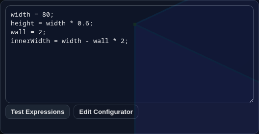
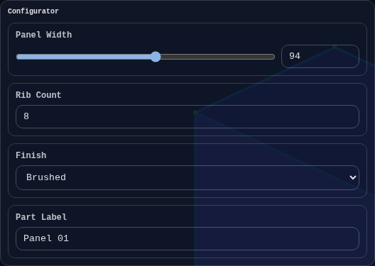
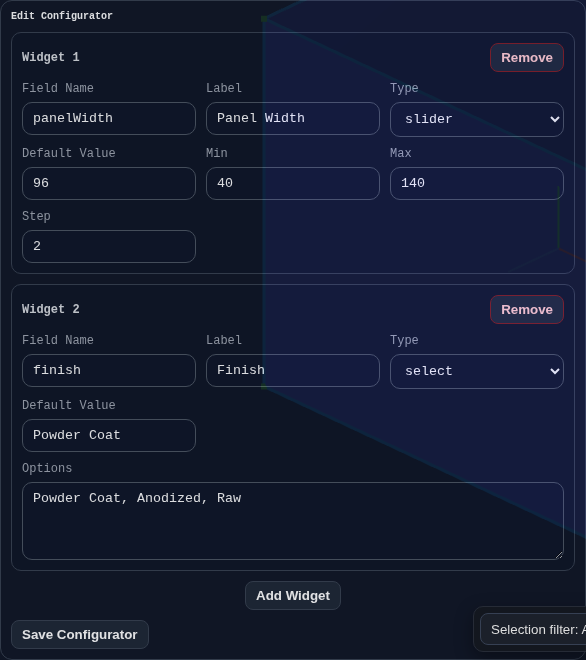

# Expressions and Configurator

Use the Expressions panel when you want a model to be driven by a few reusable values instead of typing raw numbers into every feature.

The panel has two parts:

- `Expressions`: a shared place to define variables and formulas
- `Configurator`: optional UI controls that expose a few important values as sliders, number fields, dropdowns, or text inputs

This is most useful when you want to build a part once, then resize or retune it quickly.

## Live Demos
- Examples hub: [https://BREP.io/apiExamples/index.html](https://BREP.io/apiExamples/index.html)
- Embeded CAD: [https://BREP.io/apiExamples/Embeded_CAD.html](https://BREP.io/apiExamples/Embeded_CAD.html)

## Expressions Panel

Write variables in the Expressions box, then reference those variable names in feature dialog inputs.



Example:

```js
wall = 2;
width = 80;
height = width * 0.6;
innerWidth = width - wall * 2;
```

Then in a feature dialog you can enter values such as:

```js
width
```

```js
height
```

```js
width - wall * 2
```

## Quick Start

1. Open the `Expressions` panel in Modeling Mode.
2. Add a few variables in the main text area.
3. Click `Test Expressions`.
4. In feature dialogs, enter those variable names instead of fixed numbers.
5. Change the variables later to update the model.

This lets you control repeated dimensions from one place.

## Configurator

The configurator is for values that should be adjusted through UI controls instead of editing the script directly.

If no configurator widgets exist, the configurator form stays hidden.

When widgets do exist, the form appears above the Expressions editor.



Supported widget types:

- `slider`: best for bounded numeric values you want to drag
- `number`: best for precise numeric entry
- `select`: best for choosing from a small list of options
- `string`: best for names, labels, and other text values

Configurator values are available inside expressions as:

```js
configurator.fieldName
```

Example:

```js
panelWidth = configurator.panelWidth;
finish = configurator.finish;
labelText = configurator.partLabel;
```

You do not need to create an intermediate variable first. In many cases you can enter the configurator value directly in a feature dialog input, for example:

```js
configurator.panelWidth
```

```js
configurator.partLabel
```

## Editing the Configurator

Click `Edit Configurator` below the Expressions area to add or change widgets.



Typical setup:

1. Click `Edit Configurator`.
2. Click `Add Widget`.
3. Set the `Field Name`.
4. Choose the widget `Type`.
5. Set the default value and any limits or options.
6. Click `Save Configurator`.

After saving, the live configurator form appears above the Expressions editor.

## Naming Rules

Each widget needs a field name that can be referenced from expressions.

Good examples:

- `panelWidth`
- `rib_count`
- `partLabel`

Avoid spaces and punctuation in field names. Use letters, numbers, `_`, and `$`.

## How Editing Behaves

- Changing a value in the live configurator form re-runs the model.
- Text and number inputs apply when you press `Enter` or leave the field.
- Slider drags update live.
- While `Edit Configurator` is open, the preview above updates as you add or remove widgets.
- That preview does not re-run the model until you save or close the configurator editor.

## Practical Example

Create these configurator fields:

- `panelWidth` as a slider
- `panelHeight` as a number field
- `finish` as a select
- `label` as a string

Then write expressions like:

```js
wall = 2;
outerWidth = configurator.panelWidth;
outerHeight = configurator.panelHeight;
innerWidth = outerWidth - wall * 2;
innerHeight = outerHeight - wall * 2;
titleText = configurator.label;
```

Now feature dialogs can use:

```js
outerWidth
innerWidth
titleText
```

That gives you one place to control the whole part.

## Where You Can Use Expressions

Expressions are mainly intended for feature dialog inputs.

Common cases:

- numeric fields
- transform values
- vector component fields
- some text fields

If a feature dialog supports expressions, you can enter either a direct value like `20` or an expression like `width * 0.5`.

You can also enter configurator values directly, such as `configurator.panelWidth`, without first defining a separate variable in the Expressions editor.

## Saved With the Part

Expressions and configurator values are stored in part history, so they stay with the model through:

- save and load
- JSON export and import
- undo and redo
- embedded history in exported files that preserve feature history

## Related Docs

- [Modeling Mode](./modes/modeling.md)
- [Part History](./part-history.md)
